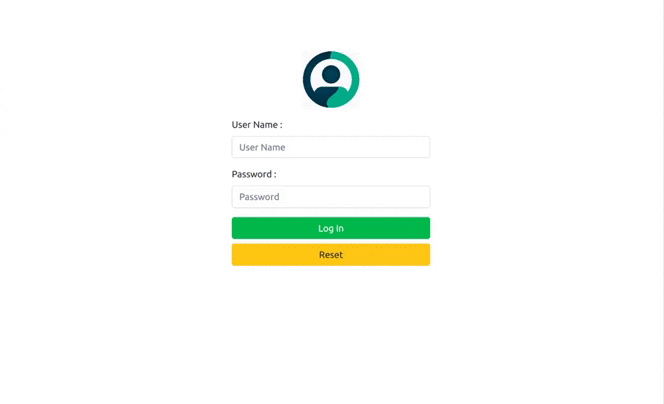

# World Clock

# Preview

## Desktop View



## Mobile View


# Various Functionality

1. Showing time of Unite State, India and London.
2. We can set the time of United State in format (HH:MM:SS).
3. We can set the time difference for india and london from United State.
4. Time will update in 5 seconds.
5. Login (Default Username = 'admin' and Password = "admin')
6. Logout

# Techstack

### HTML, CSS, React

# Instructions to install

1. Clone this repository from https://github.com/dheerajk7/world-clock-test.git .
2. Install NPM if you have not installed yet.
3. Go to project directory and run these commands

   #### To install node Modules

   ```
   npm install
   ```

   #### To run project

   ```
   npm start
   ```

4. Go and check at http://localhost:3000

# Directory Structure

`/` - all react app files <br>
`/src` - all react app code files <br>
`/src/components`- all react component files <br>
`/src/styles` - all CSS style files <br>

---
